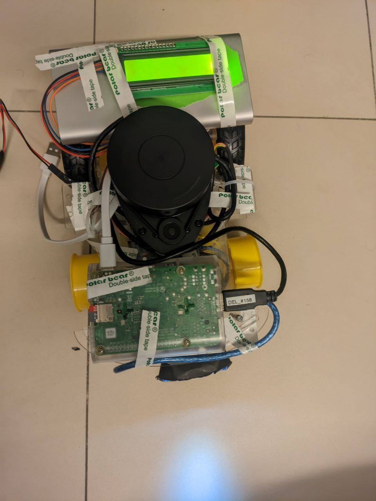

# CG2111A
A repository recording our groups code for NUS Module CG2111A Engineering Principles 2

## Description
Remotely controlled robot with SLAM, controlled using SSH.

## Functionality
4 Directional movement 
Custom Display Text on LCD
Colour Identification
Mapping using Lidar and RViz

## Directory
- ./keys contains the keys created by ryan
- ./TLSSERVEr contains ./TLSSERVEr/tls-alex-server which is used to start the server to be connected from client to send commands
- ./w8s2 contains alex.ino and alex-pi
  - alex.ino contains most recent arduino loop
  - use ./alex-pi to start movement from alex's terminal 

  
